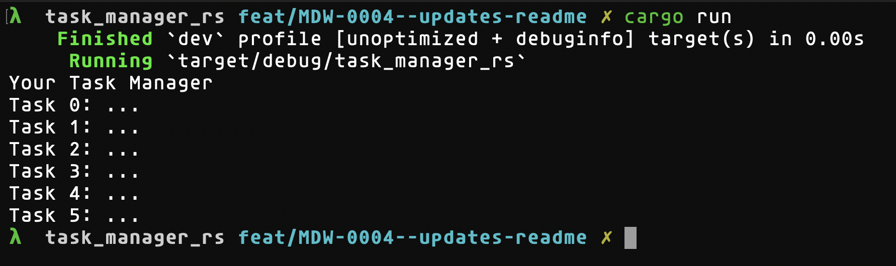

# Task Manager Rust



This task manager runs in the CLI...

## Built With

- Rust
- Cargo

## Setup & Instructions

```bash
# Clone repository to local machine
git clone https://github.com/MDW-94/task_manager_rs.git

# Install dependencies
cargo install

# To run program
cargo run
```

## TODO:

- Update README.md, try this style https://github.com/othneildrew/Best-README-Template
- Take user input
- Write tests
- Commit hook?
- Cool CLI display
- Alarms?
- Ways to tick off tasks, have them crossed out in CLI
